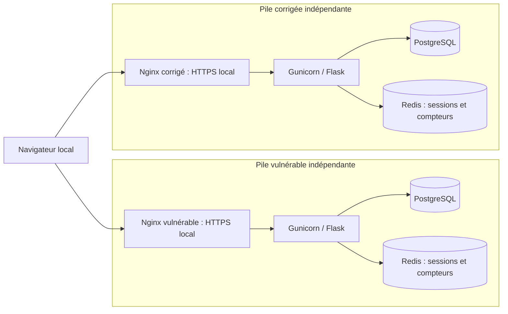

# Architecture validée — réalisation future

M1, M2, M3 et M3-Git sont validées selon le cadrage M4. M3 ajoute une fabrique `create_app`, la route technique `/healthz` et les fichiers Docker pour la première pile ; son exécution Linux est vérifiée en CI ; Docker Desktop local reste non vérifié. Les composants métier, modules et flux ci-dessous restent prévus ; aucun comportement métier n’est implémenté ; les vérifications d’infrastructure et leurs limites figurent dans docker.md. Les versions d’outillage retenues figurent dans le [guide de développement](development.md).

## Composants et responsabilités

M6 réalise l'authentification de référence dans `vulnerable-app` : formulaires Jinja locaux, identité Flask-Login, sessions et compteurs Redis, CSRF, account en lecture seule et logout POST. Les contrats et limites effectivement testées sont décrits dans [auth-sessions.md](auth-sessions.md). Les routes de tickets/commentaires, les faiblesses pédagogiques et `secure-app` restent futures ; les passages historiques M1–M5 ci-dessous décrivent leur état lors de ces missions.

M5 réalise le socle de persistance de la seule application de référence : configuration SQL sans connexion à l'import, modèles users/tickets/comments, migrations et fixtures explicites. Aucune route métier ou autorisation n'est encore réalisée ; les composants fonctionnels ci-dessous restent prévus. Voir le [guide M5](data-foundation.md) et l'[ADR 0005](decisions/0005-data-foundation.md).

Chaque version est un monolithe modulaire Flask, avec rendu serveur Jinja et ressources HTML/CSS locales, sans frontend séparé. Nginx est configuré en M4 pour terminer le HTTPS local et transmettra les requêtes à Gunicorn, qui exécutera Flask. PostgreSQL conservera les données métier ; SQLAlchemy assurera leur mapping, psycopg la connexion et Alembic les migrations.

Flask-Login gérera l’identité connectée, Flask-Session les sessions côté serveur dans Redis, Flask-WTF les formulaires et la protection CSRF, Argon2id le hachage des mots de passe. Flask-Limiter utilisera les compteurs Redis. Les autorisations métier resteront des contrôles serveur explicites.

Docker Compose définira deux environnements indépendants. Chaque version aura son Nginx, Flask/Gunicorn, PostgreSQL et Redis, ainsi que ses réseaux, volumes, secrets et sessions. Seul Nginx publiera des ports sur `127.0.0.1` ; Flask, PostgreSQL et Redis n’en publieront pas.



Le navigateur constitue une frontière distincte ; voir les [limites d’isolation](lab-safety.md).

## Modules prévus dans chaque application

| Module | Responsabilité |
| --- | --- |
| Authentification | Inscription, connexion, déconnexion, identité et cycle de session |
| Tickets | Routes de gestion des tickets privés et de leurs commentaires |
| Administration | Fonctions réservées aux administrateurs, gestion du statut actif des comptes |
| Services | Cas d’usage, règles métier et transactions |
| Autorisations | Vérifications du rôle, de la propriété et de l’accès aux objets |
| Modèles | Entités SQLAlchemy et relations persistantes |
| Templates | Rendu Jinja, formulaires et vues HTML ; CSS local dans les ressources statiques |

## Contrats et modèle métier communs

Les deux versions conserveront les mêmes contrats métier et schémas de données afin de rendre la comparaison reproductible. Les fixtures fictives et outils de tests pourront être partagés ; ni l’authentification, ni les autorisations, ni les sessions ou autres implémentations sensibles ne seront mutualisées. Les migrations resteront propres aux applications et devront préserver la cohérence des schémas.

| Entité | Champs prévus |
| --- | --- |
| `users` | Identifiant, nom d’utilisateur normalisé unique, hachage du mot de passe, nom affiché, rôle, statut actif, dates de création et de modification |
| `tickets` | Identifiant, propriétaire lié à `users`, titre, description, statut, dates de création et de modification |
| `comments` | Identifiant, ticket lié à `tickets`, auteur lié à `users`, contenu, date de création |

- Rôles : `user` et `admin`. L’inscription crée toujours `user` ; les administrateurs fictifs seront créés par une future commande locale.
- Statuts des tickets : `open`, `in_progress`, `closed`.
- Le propriétaire est déterminé côté serveur à la création et reste immuable, même pour un administrateur. L’auteur d’un commentaire est l’acteur connecté, déterminé côté serveur.
- La suppression d’un ticket supprime ses commentaires. Les comptes sont désactivés, sans suppression physique initiale, pour conserver les références métier.
- Sessions et compteurs de limitation résident dans le Redis de la version concernée.
- Les tickets sont privés. Les règles de référence détaillées sont dans la [matrice d’autorisations](authorization-matrix.md). Les écarts pédagogiques seront documentés individuellement, jamais supposés.

## Arborescence cible — éléments métier futurs

Les packages sont distincts : `vulnerable-app/src/vulnlab_vulnerable/` et `secure-app/src/vulnlab_secure/`. Seul le premier et sa fabrique technique existent en M3. Le second sera créé par copie traçable après audit.

```text
vulnerable-app/
├── pyproject.toml, uv.lock, .python-version (présents en M2)
├── src/vulnlab_vulnerable/
│   ├── __init__.py (fabrique technique présente en M3)
│   └── auth/, tickets/, admin/, services/, authorization/,
│       models/, templates/, static/css/ (futurs)
├── tests/test_packaging.py et tests/test_health.py (présents en M3)
└── migrations/ (futur)
secure-app/
├── README.md (seul fichier actuel)
├── pyproject.toml, uv.lock, .python-version (futurs, indépendants)
├── src/vulnlab_secure/ (futur, mêmes responsabilités modulaires)
├── tests/ (futur)
└── migrations/ (futur)
tests/ (futurs outils communs et fixtures fictives)
docs/ (documents actuels ; fiches d’audit et preuves à venir)
.github/workflows/ci.yml (préparé en M2, vérifications uniquement)
```

Chaque application conservera son environnement `.venv` et son verrou propres, sans workspace uv global. Aucun module métier factice n’est créé pour reproduire l’arborescence future.

Ruff et quatre tests Pytest (installation et contrat HTTP technique) sont opérationnels sous Windows. Le groupe build et Gunicorn Linux sont verrouillés. M4 remplace le port utilisateur HTTP par HTTPS loopback 8443 et un hôte attendu unique ; secure.vulnlab.test reste réservé. Une sonde HTTP uniquement sur le loopback interne du proxy complète les tests TLS externes au conteneur. Ingress du proxy reste non interne ; frontend et backend des services restent internes, avec limites de sorties explicites. Voir [docker.md](docker.md) pour la topologie actuelle et les contrôles non exécutés. Les tests HTTP, Playwright et les tests métier seront introduits ultérieurement. Le workflow GitHub Actions vise Windows et Linux, sans déploiement ; ses trois jobs ont réussi sur GitHub.
